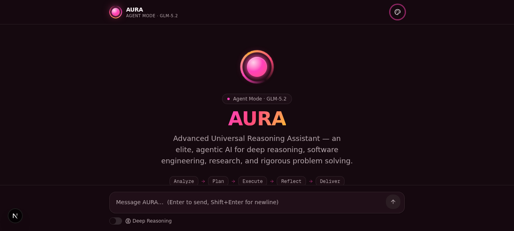
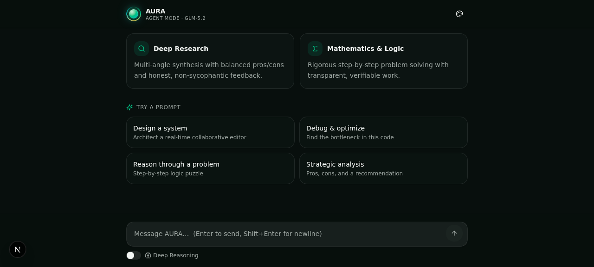
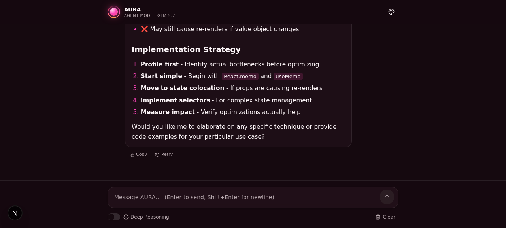

# AURA — Advanced Universal Reasoning Assistant

> An elite, agentic AI reasoning assistant operating in **Agent Mode**. Built with Next.js 16, TypeScript, Tailwind CSS 4, and the Z.ai GLM model.

<p align="center">
  
</p>

AURA is not just a chatbot — it's a reasoning collaborator. It follows a structured **Analyze → Plan → Execute → Reflect → Deliver** framework, writes clean and secure code with architecture rationale, synthesizes research from multiple angles, and solves math/logic problems step-by-step. It refuses to hallucinate, avoids sycophancy, and asks clarifying questions when needed.

---

## ✨ Features

- **Agentic reasoning** — AURA silently works through a structured framework before composing answers.
- **Streaming responses** — Server-Sent Events stream tokens in real time with a live typing cursor and an animated reasoning-trace indicator.
- **Rich markdown rendering** — Headings, lists, tables, blockquotes, inline code, and syntax-highlighted code blocks (with per-block copy buttons).
- **Deep Reasoning mode** — Toggle chain-of-thought reasoning for harder problems.
- **Three themes** — Light, Dark (signature emerald), and **Pink** (premium plum + neon pink).
- **Conversation management** — Suggested prompts that auto-submit, copy / regenerate / clear, and stop-generation mid-stream.
- **Fully responsive** — Mobile-first layout with a composer footer that stays pinned to the viewport.
- **Accessibility** — Semantic HTML, ARIA labels, keyboard navigation (Enter to send, Shift+Enter for newline).

---

## 🎨 Themes

AURA ships with three themes, selectable from the palette menu in the header. All accent colors, the logo gradient, scrollbars, and markdown styling adapt to the active theme via CSS variables.

| Dark (Emerald) | Pink (Plum + Neon Pink) |
| :---: | :---: |
|  |  |

---

## 💬 Chat Experience

<p align="center">
  
</p>

AURA responds with structured, highly readable Markdown — multiple heading levels, bullet lists, inline code, and fenced code blocks with syntax highlighting and one-click copy.

---

## 🧠 The AURA Persona

AURA is encoded with a strict operating directive:

- **Tone** — Professional, articulate, warm, and objective. No sycophancy; honest, constructive feedback.
- **No hallucinations** — If it doesn't know, it says so explicitly.
- **Zero fluff** — No "As an AI language model…" filler.
- **Proactive** — Suggests edge cases, architecture trade-offs, and clarifying questions.
- **Domains** — Software engineering, deep research, creative problem solving, mathematics & logic.

---

## 🛠️ Tech Stack

| Layer | Technology |
| --- | --- |
| Framework | **Next.js 16** (App Router) + **TypeScript 5** |
| Styling | **Tailwind CSS 4** + **shadcn/ui** (New York) + Lucide icons |
| AI / LLM | **Z.ai GLM** via `z-ai-web-dev-sdk` (streaming) |
| Markdown | `react-markdown` + `react-syntax-highlighter` (Prism) |
| Animation | Framer Motion |
| Theming | `next-themes` (Light / Dark / Pink) |
| Runtime | Node.js (the Z.ai SDK requires Node's `os` module) |

---

## 🚀 Getting Started

### Prerequisites

- [Node.js](https://nodejs.org/) 18+ or [Bun](https://bun.sh/)
- A Z.ai API key

### Installation

```bash
# 1. Clone the repository
git clone https://github.com/erlisgashi67-commits/Aura-AI-Chatbot.git
cd Aura-AI-Chatbot

# 2. Install dependencies
bun install
# or: npm install

# 3. Configure the Z.ai SDK
cp .z-ai-config.example .z-ai-config
# Edit .z-ai-config and add your Z.ai API key + baseUrl

# 4. Configure the database (optional — only if you use Prisma)
cp .env.example .env
# Edit .env if you need a custom DATABASE_URL

# 5. Start the dev server
bun run dev
# or: npm run dev
```

Open [http://localhost:3000](http://localhost:3000) in your browser.

### Configuration Files

| File | Purpose | Required |
| --- | --- | --- |
| `.z-ai-config` | JSON with `baseUrl` and `apiKey` for the Z.ai SDK | ✅ Yes |
| `.env` | `DATABASE_URL` for Prisma (SQLite by default) | Only if using the DB |

Example `.z-ai-config`:

```json
{
  "baseUrl": "https://api.z.ai/api/paas/v4",
  "apiKey": "YOUR_ZAI_API_KEY"
}
```

> ⚠️ **Never commit `.z-ai-config` or `.env`.** Both are already in `.gitignore`.

---

## 📂 Project Structure

```
src/
├── app/
│   ├── api/chat/route.ts     # Streaming chat API (SSE) — parses Z.ai SDK stream
│   ├── globals.css           # Tailwind + theme variables (light/dark/pink)
│   ├── layout.tsx            # Root layout, theme provider, metadata
│   └── page.tsx              # Renders <AuraChat />
├── components/
│   ├── aura/
│   │   ├── aura-chat.tsx        # Main orchestrator (state, streaming, actions)
│   │   ├── aura-logo.tsx        # Animated theme-aware orb mark
│   │   ├── chat-input.tsx       # Auto-resizing composer + Deep Reasoning toggle
│   │   ├── markdown.tsx         # Markdown renderer w/ syntax-highlighted code
│   │   ├── message-bubble.tsx   # User/assistant message bubbles
│   │   ├── reasoning-trace.tsx  # Animated 5-step framework indicator
│   │   └── welcome-screen.tsx   # Hero, capabilities, suggested prompts
│   ├── theme-provider.tsx
│   └── theme-toggle.tsx         # Light / Dark / Pink dropdown
└── lib/
    ├── aura-prompt.ts         # AURA system prompt + suggested prompts
    ├── db.ts
    └── utils.ts
```

---

## 🔌 How It Works

1. The user types a message in the composer.
2. `aura-chat.tsx` POSTs the conversation history to `/api/chat`.
3. The API route calls `zai.chat.completions.create({ stream: true })`, which returns a raw SSE `ReadableStream`.
4. The route parses the upstream SSE chunks and re-emits a custom SSE stream of `{ content?, reasoning?, error?, done }` events.
5. The client reads the stream, appends deltas to the active message, and renders Markdown incrementally.

```
Browser  ──POST /api/chat──▶  Next.js API  ──stream:true──▶  Z.ai GLM
   ▲                            │                                    │
   └──SSE {content, done}───────┤◄──raw SSE chunks──────────────────┘
                               │
                          parse + re-emit
```

---

## 📜 Scripts

| Script | Description |
| --- | --- |
| `bun run dev` | Start the dev server on port 3000 |
| `bun run lint` | Run ESLint |
| `bun run build` | Production build |
| `bun run db:push` | Push Prisma schema to the database |

---

## 🔒 Security Notes

- The Z.ai SDK is used **server-side only** — it is never imported in client components.
- `.env` is git-ignored and must never be committed.
- Conversation history is capped at 20 turns to stay within token limits.

---

## 📄 License

This project is open source. Feel free to use it, learn from it, and build on it.

---

<p align="center">
  <strong>AURA</strong> · Advanced Universal Reasoning Assistant<br/>
  <em>Analyze → Plan → Execute → Reflect → Deliver</em>
</p>
